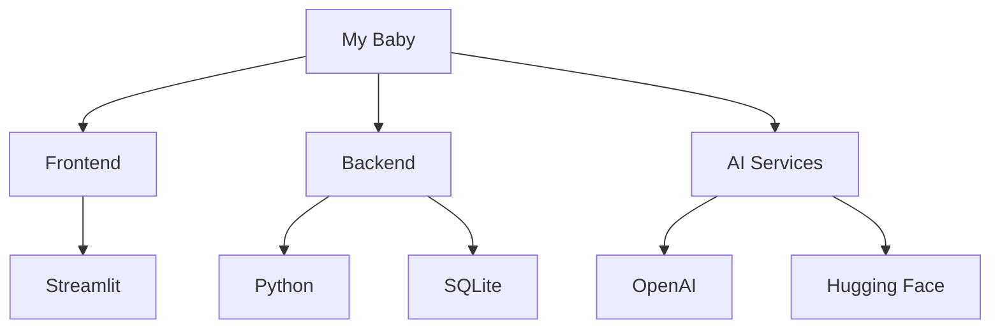
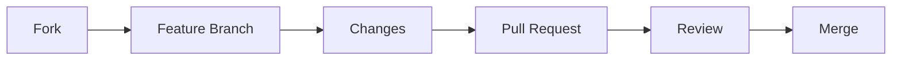

# My Baby - AI Pregnancy Assistant

<p align="center">
    
</p>

<p align="center">
    <a href="https://www.python.org/downloads/">
        
    </a>
    <a href="https://streamlit.io">
        
    </a>
    <a href="LICENSE">
        
    </a>
    <a href="https://github.com/your-repo/my-baby/issues">
        
    </a>
</p>

<p align="center">
    <a href="#demo">View Demo</a>
    ·
    <a href="#installation">Installation Guide</a>
    ·
    <a href="#contributing">Contributing</a>
    ·
    <a href="#support">Support</a>
</p>

## 🌟 Overview

**My Baby** is a comprehensive AI-powered web application designed to support mothers throughout their pregnancy journey. Built with Streamlit and powered by advanced AI models, it offers personalized guidance, health monitoring, and essential pregnancy-related information at your fingertips.

<p align="center">
    
</p>

## ✨ Features

<details>
<summary>🗓️ Pregnancy Tracker</summary>
<br>
• Week-by-week development tracking<br>
• Important milestone notifications<br>
• Customized pregnancy timeline<br>
• Baby growth visualization
</details>

<details>
<summary>🏥 Health Monitoring</summary>
<br>
• Mental health assessment and tips<br>
• Physical symptom checker<br>
• Automated health alerts<br>
• Mood tracking and analysis
</details>

<details>
<summary>🥗 Nutrition & Exercise</summary>
<br>
• Trimester-specific meal plans<br>
• Safe exercise routines<br>
• Nutritional recommendations<br>
• Customized workout schedules
</details>

<details>
<summary>🎤 Voice-Activated Assistant</summary>
<br>
• Hands-free interaction<br>
• Voice command support<br>
• Natural language processing<br>
• Multi-language support
</details>

<details>
<summary>👩‍⚕️ Virtual Doula</summary>
<br>
• Labor preparation guidance<br>
• Postpartum care information<br>
• 24/7 AI-powered support<br>
• Emergency protocol assistance
</details>

## 💻 Tech Stack



## 👥 Our Amazing Team
<center>
<table>
<tr>
    <td align="center">
        <a href="https://github.com/Ahmad-Fakhar">
            <br />
            <sub><b>Ahmad Fakhar</b></sub>
        </a>
        <br />
        <sub>Data Analyst</sub>
        <br />
        <a href="https://www.linkedin.com/in/ahmad-fakhar-357742258/">
            
        </a>
    </td>
    <td align="center">
        <a href="https://github.com/Asimbaloch">
            <br />
            <sub><b>Asim Khan</b></sub>
        </a>
        <br />
        <sub>ML Expert</sub>
        <br />
        <a href="https://www.linkedin.com/in/asim-khan-baloch/">
            
        </a>
    </td>
    <td align="center">
        <a href="https://github.com/devtayyabsajjad">
            <br />
            <sub><b>Tayyab Sajjiad</b></sub>
        </a>
        <br />
        <sub>Software Developer</sub>
        <br />
        <a href="http://www.linkedin.com/in/tayyab-sajjad-156ab2267">
            
        </a>
    </td>
    <td align="center">
        <a href="https://github.com/muhammadibrahim313">
            <br />
            <sub><b>Muhammad Ibrahim</b></sub>
        </a>
        <br />
        <sub>Data Scientist</sub>
        <br />
        <a href="https://www.linkedin.com/in/muhammad-ibrahim-qasmi-9876a1297/">
            
        </a>
    </td>
</tr>
</table></center>

## 🚀 Installation

```bash
# Clone the repository
git clone https://github.com/your-repo/my-baby.git

# Navigate to project directory
cd my-baby

# Create virtual environment
python -m venv venv
source venv/bin/activate  # On Windows: venv\Scripts\activate

# Install dependencies
pip install -r requirements.txt

# Set up environment variables
cp .env.example .env

# Launch the app
streamlit run app.py
```

## 📸 Screenshots

<p align="center">
<table>
    <tr>
        <td align="center"><b>Home Screen</b></td>
        <td align="center"><b>Pregnancy Tracker</b></td>
        <td align="center"><b>Health Monitor</b></td>
    </tr>
    <tr>
        <td></td>
        <td></td>
        <td></td>
    </tr>
</table>
</p>

## 🤝 Contributing

We love your input! We want to make contributing to My Baby as easy and transparent as possible. Please see our [Contributing Guidelines](CONTRIBUTING.md) for detailed information.



## 📄 License

This project is licensed under the MIT License - see the [LICENSE](LICENSE) file for details.

## 🙏 Acknowledgments

- OpenAI for GPT integration
- Hugging Face for transformer models
- Streamlit team for the amazing framework
- All contributors who helped make this project possible

## 📞 Support

<p align="center">
    <a href="https://github.com/your-repo/my-baby/issues">
        
    </a>
    <a href="mailto:support@mybaby.com">
        
    </a>
</p>

## ⭐ Show your support

Give a ⭐️ if this project helped you!

<p align="center">
    <a href="https://www.buymeacoffee.com/yourprofile">
        
    </a>
</p>

---

<p align="center">Made with ❤️ by the My Baby Team</p>
